## Main challenges: 

### 1) Code will be provided to "Preview" as a string. Find a way how to execute strings safely.
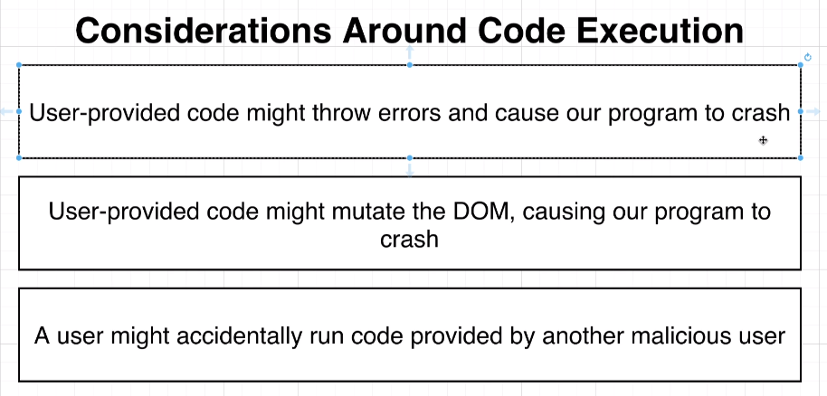

* A possible general solution for all three problems lister above would be to wrap users code intro an [iframe](https://developer.mozilla.org/en-US/docs/Web/HTML/Element/iframe) element. 

  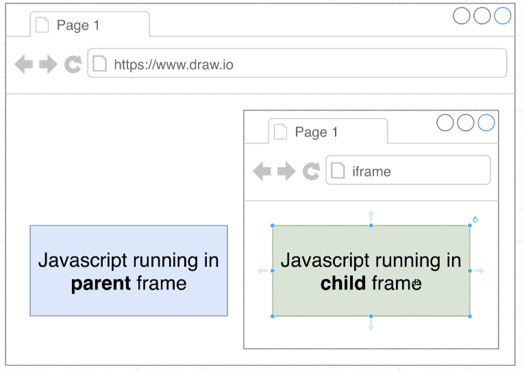
  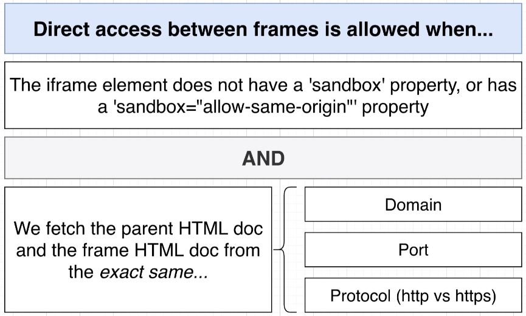

  `iframe`s provide two different contexts in which we can execute java script code:

    - in the context of the parent frame 
    - in the context of the `iframe` - there is no visibility of any information that is contained in the parent frame

    There is also a settings of the `iframe` which provides intercommunication 
    between the parent and child. This intercommunication allows 
    parent element to reach out in `iframe`'s code and use some variables and vise versa (`iframe` using parent's code)

---
### 2) Code might have advanced JS syntax in it (such as JSX) that the browser can't execute. Find out how the browser can execute advanced JS syntax. 

- One possible solution is to use a `Transpiler` AKA `Transcompilation` - [Babel](https://babeljs.io/docs/en/)
    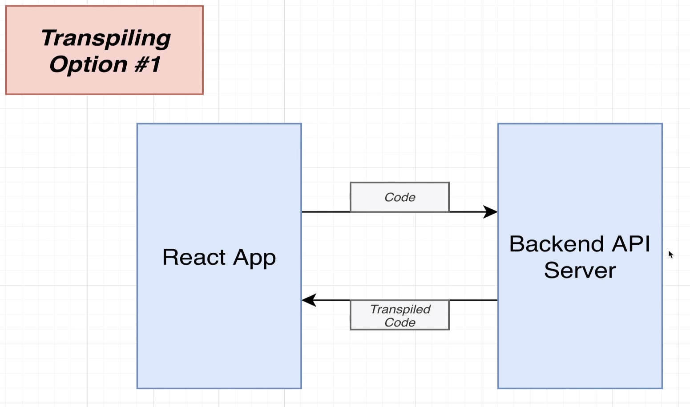
    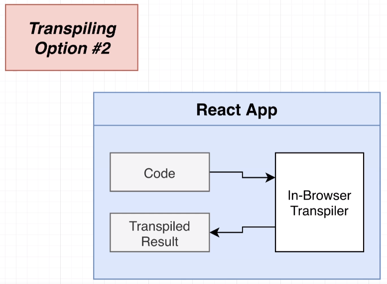

---

### 3) Code will have imports statements for other/3rd party JS files/packages or CSS. Find a way how to deal with those import statements/downloading 3rd party packages before executing the code 

*  One possible solution is to use a Module Bundler - [Webpack](https://webpack.js.org/)

   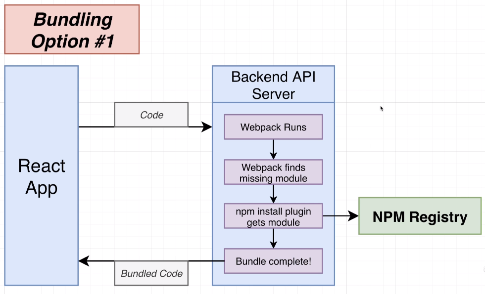

    For **Option #1** implementation could rely on a plugin  [NpmInstallWebpackPlugin](https://v4.webpack.js.org/plugins/npm-install-webpack-plugin/) 
Usually when `webpack` is bundling the code, if it finds an import statement for a module that is not installed locally will throw an error. 
This plugin slightly changes this behavior, rather than throwing an error it will 
automatically install this module directly from `npm` on the local machine (in this case the API server) and allows `webpack` to continue with the bundling process as usual. 

    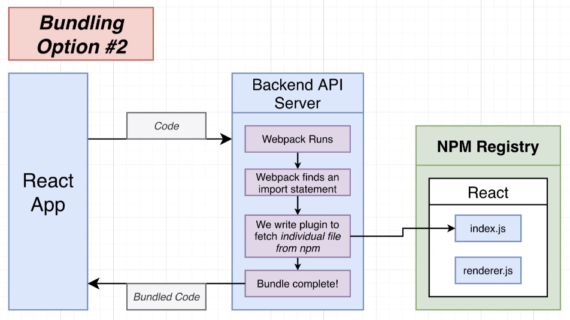

    For **Option #2** we use a custom written plugin that every time webpack detects
some 3rd party imports such as `React`, `lodash`, `axios`, etc. the plugin makes a request to the `npm` registry and gets the source code of that 3rd party library. The source code then is returned and passed back to webpack so it continues with the bundling process. This is almost identical to **Option #1**, but it doesn't save 
the dependency onto the local machine (API server), even though a caching strategy might help us prevent downloading a library every time someone is trying to import it. 

    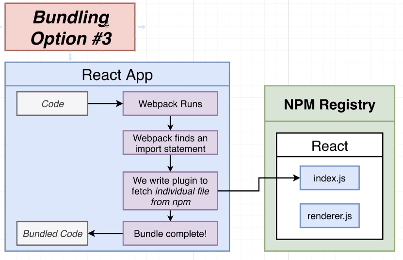

    **Option #3** can omit the backend API server and instead implement all the webpack 
 processing directly into the `React` application. That means that there will be no outside request or API which in theory it should speed up the process of running the 
 users code. In addition, this approach enforces the webpack processing to be done on the users machine, rather than a backend server.

---
---

## Implementation
   ### 1) Build `bundling` and `transpiling` directly into the `React` app:
   - Removes an extra request to the API server - faster code execution!
   - Don't have to maintain an API server
   - In theory there will be less complexity - no moving code back and forth

   ### 2) Build `bundling` and `transpiling` inside some API:
   - We can cache downloaded `NPM` modules to bundle code faster
   - Will work better for users with slow devices or limited internet connections

   This projects implements the 1st approach: *`bundling` and `transpiling` directly into the `React` app*. There is one drawback, however: 
   
   - **Webpack does't work correctly in the browser** 
  
  A solution for this would be to throw away `Webpack` and `Babel` and use  [ESBuild](https://esbuild.github.io/). This bundler is a single standalone tool that can **extremely fast** transpile + bundle code all in the browser and completely replaces both `Webpack` and `Babel`.

  Rather than hosting its binary the package is fetched from unpkg.com

---

As mentioned in **3)**, **Option #2**, a custom plugin is needed to intercept the default behavior of `ESBuild`. When a bundling file has imported CommonJs/ES module/s, the default behavior of `ESBuild` is to find this module/s on the local machine. Instead, the plugin intercepts this behavior and carries the search itself, telling to `ESBuild` - "Wait, let me find this module and return it back to you". 

This projects will be fetching modules/libraries from [UNPKG](https://unpkg.com/) due to [CORS](https://reactjs.org/docs/cross-origin-errors.html) issues with [NPM](https://www.npmjs.com/) registry. 

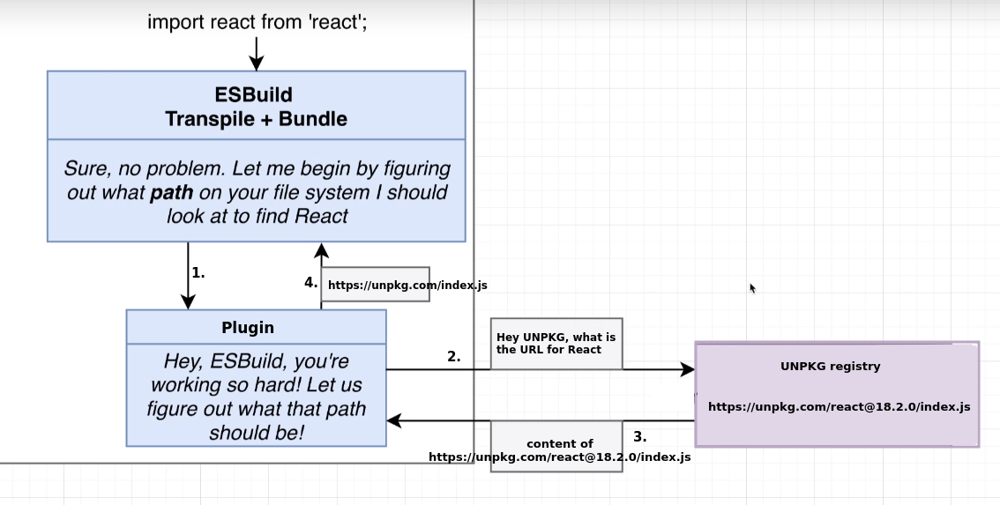

---

To reduce the number of request we are making to `UNPKG` a little caching layer is implemented. 

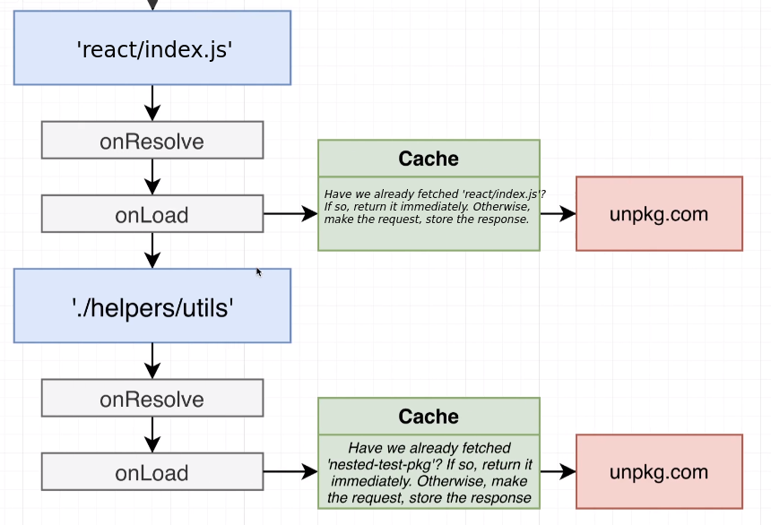

Whenever we are trying to fetch a file/package we first determine the path where the file/package is stored inside the **onResolve** and eventually load that file (fetch from unpkg.com) inside of **onLoad**. 

 [IndexedDB](https://developer.mozilla.org/en-US/docs/Web/API/IndexedDB_API) mechanism is used for storing information inside the browser, which is very similar to `localStorage`. 
 Instead of working directly with `IndexedDB`, this projects uses [localforage](https://www.npmjs.com/package/localforage). `Localforage` works with `IndexedDb` or `WebSQL` underneath and falls back on using `localStorage` in browsers with no `IndexedDb` or `WebSQL` support. 

 ---

   ### 3) Redux Design:
   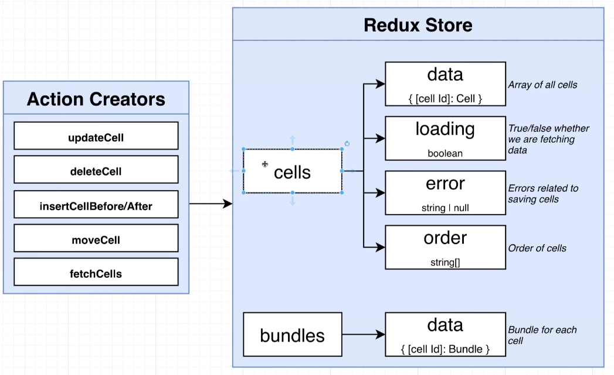

   Redux store will have 2 separate reducers:
   - Cells: listing of all the different cells (text/code cell) that we want to display
     on the screen. Inside the cells reducer there is a couple of different properties 
     being maintained.
     - data: collection of all the different cells (code/text cells)
     - loading/error flags: allow user to save/fetch list of cells from a remote API (hosted on a users machine)
     - order: makes sure to reflect the exact order of the cells that have been introduced/created

   - Bundles: holds the bundled output from every code cell. 

   Variety of different action creators: 
   - updateCell: For updating a cell whenever user types inside a text/code cell 
   - deleteCell: For deleting a cell
   - insertCellBefore/After: Allows to insert new cells between existing ones 
   - moveCell: Moves cells up/down of a listing 
   - fetchCell: Fetch existing list of cells from the local API

